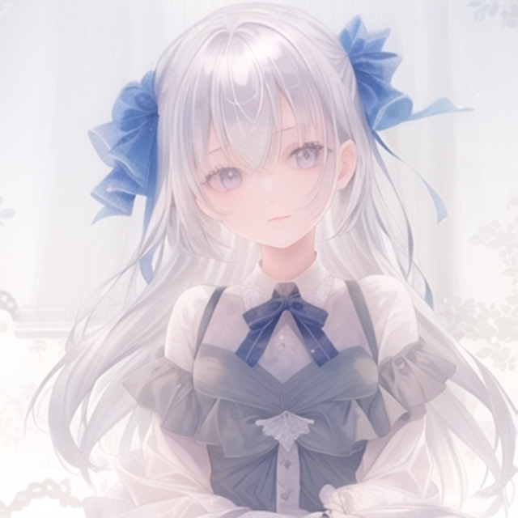

# **ControlNet1.1のサンプル画像です**
※基になったポーズはすべて[ぱくたそ](https://www.pakutaso.com/)さんから使用しています

## **Openpose Hand**
 

|  元画像 |  ポーズ画像  |
| ---- | ---- |
|    |   |

|  生成画像(Anything V4.5)   | 
| ---- | 
|    |
 

## **Openpose Face**
 

|  元画像  |  顔ランドマーク画像  |
| ---- | ---- |
|    |  

|  生成画像(animelike2D)  | 
| ---- |
|    |
|    |
 

## **Lineart Realistic**
 

|  元画像  |  Lineart  |
| ---- | ---- |
|    |  

|  生成画像(Stable diffusion1.5)  | 
| ---- | 
|    |
 

## **Lineart Anime**
 

|  元画像  |  Lineart  |
| ---- | ---- |
|    |  

|  生成画像(Anything V4.5)  | 
| ---- | 
|    |
 

## **Soft Edge**
 

|  元画像  |  抽出画像  |
| ---- | ---- |
|    |  

|  生成画像(Stable diffusion1.5)  | 
| ---- | 
|    |
 

## **Instruct Pix2Pix**
 

|  元画像  |
| ---- |
|    |

|  生成画像(Stable diffusion1.5)  | 
| ---- | 
|  
  |

 

## **Shuffle**
 

|  元画像  |  シャッフル画像  |
| ---- | ---- |
|    |  

|  生成画像(Stable diffusion1.5)  | 
| ---- | 
|    |
 

## **Inpaint**
 

|  元画像  |  インペイント画像  |
| ---- | ---- |
|    |  

|  生成画像(Stable diffusion1.5)  | 
| ---- | 
|    |
 

## **Depth Zoe**
 

|  元画像  |  抽出画像  |
| ---- | ---- |
|    |  

|  生成画像(Stable diffusion1.5)  | 
| ---- | 
|    |
 

## **Segmentation**
 

|  元画像  |  抽出画像  |
| ---- | ---- |
|    |  

|  生成画像(Stable diffusion1.5)  | 
| ---- | 
|    |
 