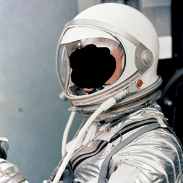

# **ControlNet1.1のサンプル画像です**
※基になったポーズはすべて[ぱくたそ](https://www.pakutaso.com/)さんから使用しています

## **Openpose Hand**
 

|  ポーズ画像  |  生成画像(Anything V4.5)  |
| ---- | ---- |
|    |  

|  基になった画像  | 
| ---- | 
|    |
 
## **Openpose Face**
 

|  顔ランドマーク画像  |  生成画像(animelike2D)  |
| ---- | ---- |
|    |  
|    |  

|  基になった画像  | 
| ---- | 
|    |
 

## **Lineart Realistic**
 

|  ポーズ画像  |  生成画像(Stable diffusion1.5)  |
| ---- | ---- |
|    |  

|  基になった画像  | 
| ---- | 
|    |
 

## **Lineart Anime**
 

|  Lineart  |  生成画像(Anything V4.5)  |
| ---- | ---- |
|    |  

|  基になった画像  | 
| ---- | 
|    |
 

## **Soft Edge**
 

|  Lineart  |  生成画像(Stable diffusion1.5)  |
| ---- | ---- |
|    |  

|  基になった画像  | 
| ---- | 
|    |
 

## **Instruct Pix2Pix**
 

|  基になった画像  |  生成画像(Stable diffusion1.5)  |
| ---- | ---- |
|    |  

 

## **Shuffle**
 

|  シャッフル画像  |  生成画像(Stable diffusion1.5)  |
| ---- | ---- |
|    |  

|  基になった画像  | 
| ---- | 
|    |
 

## **Inpaint**
 

|  インペイント画像  |  生成画像(Stable diffusion1.5)  |
| ---- | ---- |
|    |  

|  基になった画像  | 
| ---- | 
|    |
 

## **Depth Zoe**
 

|  抽出画像  |  生成画像(Stable diffusion1.5)  |
| ---- | ---- |
|    |  

|  基になった画像  | 
| ---- | 
|    |
 

## **Segmentation**
 

|  抽出画像  |  生成画像(Stable diffusion1.5)  |
| ---- | ---- |
|    |  

|  基になった画像  | 
| ---- | 
|    |
 