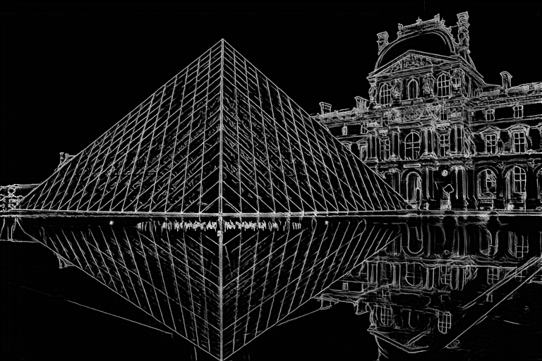

# **ControlNet1.1のサンプル画像です**
※基になったポーズは[ぱくたそ](https://www.pakutaso.com/)さん[Pixabay](https://pixabay.com/)から使用しています

## **Openpose Hand（手を含むポーズ抽出）**
 

|  元画像 |  ポーズ画像  |
| ---- | ---- |
|    |   |

|  生成画像(Anything V4.5)   | 
| ---- | 
|    |
 

## **Openpose Face（顔を含むポーズ抽出）**
 

|  元画像  |  顔ランドマーク画像  |
| ---- | ---- |
|    |  

|  生成画像(animelike2D)  | 
| ---- |
|    |
|    |
 

## **Lineart Realistic（線画抽出）**
 

|  元画像  |  Lineart  |
| ---- | ---- |
|    |  

|  生成画像(Stable diffusion1.5)  | 
| ---- | 
|    |
 

## **Lineart Anime（アニメ向け線画抽出）**
 

|  元画像  |  Lineart  |
| ---- | ---- |
|    |  

|  生成画像(Anything V4.5)  | 
| ---- | 
|    |
 

## **Soft Edge（輪郭線抽出）**
 

|  元画像  |  抽出画像  |
| ---- | ---- |
|    |  

|  生成画像(Stable diffusion1.5)  | 
| ---- | 
|    |
 

## **Instruct Pix2Pix（プロンプトによる画像編集）**
**プロンプト：make it on fire**
 

|  元画像  |
| ---- |
|    |

|  生成画像(Stable diffusion1.5)  | 
| ---- | 
|  
  |

 

## **Shuffle（画像の再構成）**
 

|  元画像  |  シャッフル画像  |
| ---- | ---- |
|    |  

|  生成画像(Stable diffusion1.5)  | 
| ---- | 
|    |
 

## **Inpaint（画像の一部分のみ修正）**
 

|  元画像  |  インペイント画像  |
| ---- | ---- |
|    |  

|  生成画像(Stable diffusion1.5)  | 
| ---- | 
|    |
 

## **Depth Zoe（深度抽出）**
 

|  元画像  |  抽出画像  |
| ---- | ---- |
|    |  

|  生成画像(Stable diffusion1.5)  | 
| ---- | 
|    |
 

## **Segmentation（領域抽出）**
 

|  元画像  |  抽出画像  |
| ---- | ---- |
|    |  

|  生成画像(Stable diffusion1.5)  | 
| ---- | 
|    |
 