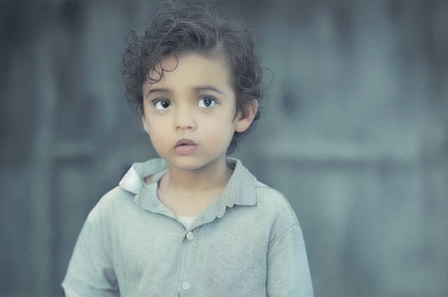
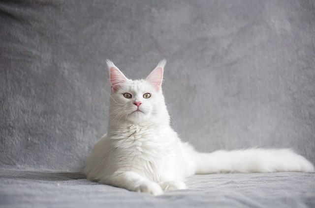
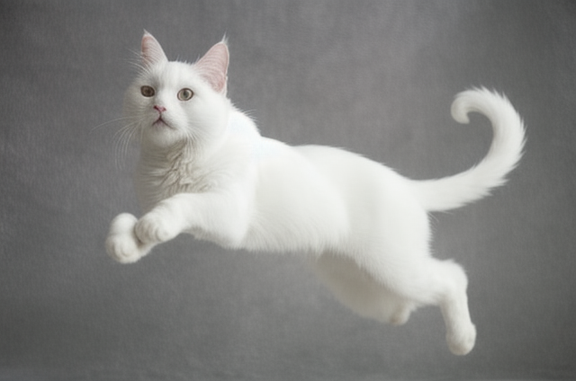
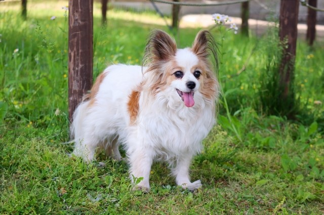
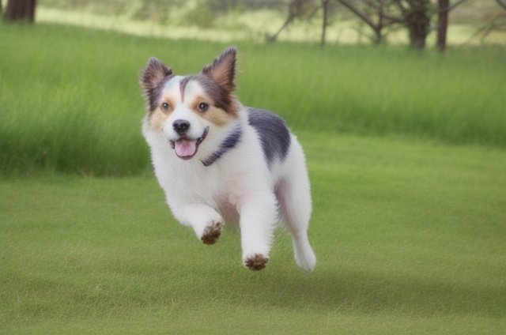
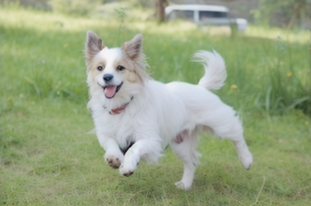
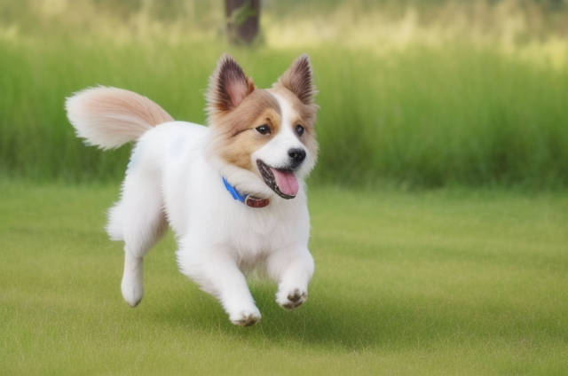
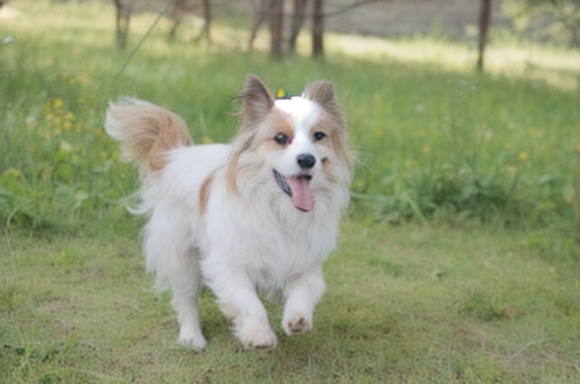
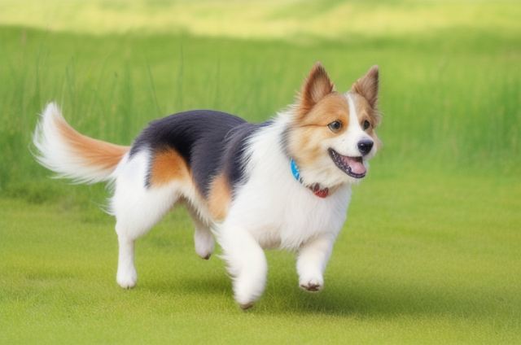

# **ControlNet-Referenceのサンプル画像です**
基本的にPreprocessorは"reference-only"で何も記載がなければControl Mode="Balanced" Style Fidelity=0.5にして実行してます。
 
Referenceの動画での紹介は[こちら](https://youtu.be/rVUXf823o6Q)

※素材は[イラストAC](https://www.ac-illust.com/)・[Pixabay](https://pixabay.com/)から使用しています

## **アニメ画像（モデルはAnything-V4.5）**
 

|  参照画像 |  reference-only  |
| ---- | ---- |
|    |   |
 

|  参照画像 |  reference-only  |
| ---- | ---- |
|    |   |
 

|  参照画像 |  reference-only  |
| ---- | ---- |
|    |   |
 

## **実写画像（モデルはRealistic_Vision1.4）**
 

|  参照画像 |  reference-only  |
| ---- | ---- |
|    |   |
 

|  参照画像 |  reference-only  |
| ---- | ---- |
|    |   |
 

|  参照画像 |  Style Fidelity=0.5  |
| ---- | ---- |
|    |   |

|  Style Fidelity=1.0 |  Style Fidelity=0.1  |
| ---- | ---- |
|    |   |
 

|  Controlnet is more important |  My prompt is more important  |
| ---- | ---- |
|    |   |
 

|  参照画像 |  Style Fidelity=0.5  |
| ---- | ---- |
|    |   |

|  reference_adain |  reference_adain+attn  |
| ---- | ---- |
|    |   |

|  adain+attn(Style Fidelity=1.0) |  adain+attn(ControlNet is more important)  |
| ---- | ---- |
|    |   |
 

**開発者よりreference_adain+attnでStyle Fidelity=1.0が最も強力とのことですが顔がだいぶ変わってしまうようです。推奨はreference_onlyでStyle Fidelity=0.5。**