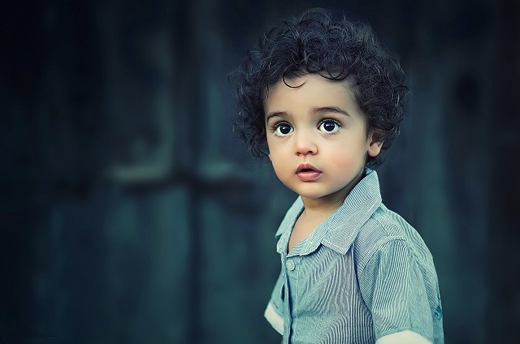

# **ControlNet-Referenceのサンプル画像です**
基本的にreference-only（Control Mode = balanced）より実行してますが、adain+attnの生成画像も最後にあります。

※素材は[イラストAC](https://www.ac-illust.com/)・[Pixabay](https://pixabay.com/)から使用しています

## **アニメ画像（モデルはAnything-V4.5）**
 

|  元画像 |  reference-only  |
| ---- | ---- |
|    |   |
 

|  元画像 |  reference-only  |
| ---- | ---- |
|    |   |
 

|  元画像 |  reference-only  |
| ---- | ---- |
|    |   |
 

|  元画像 |  reference-only  |
| ---- | ---- |
|    |   |
 

## **実写画像（モデルはRealistic_Vision1.4）**
 

|  元画像 |  reference-only  |
| ---- | ---- |
|    |   |
 

|  元画像 |  reference-only  |
| ---- | ---- |
|    |   |
 

|  元画像 |  Style Fidelity=0.5  |
| ---- | ---- |
|    |   |

|  Style Fidelity=1.0 |  Style Fidelity=0.1  |
| ---- | ---- |
|    |   |
 

| Controlnet is more important |
| ---- | 
|    | 
 